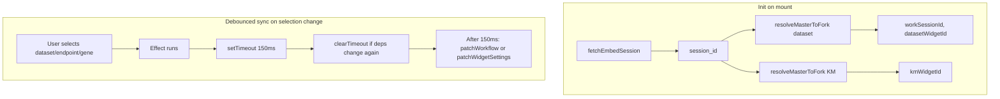

# Survival Analysis Datasets Browser

An Astro + Svelte 5 application for exploring GEO datasets used in survival analysis research.

## Current state

- Svelte 5 runes-based UI with decomposed dataset-browser components
- Strict TypeScript + runtime schema validation (Zod)
- URL-synced dataset selection/sort (`selected`, `sort`, `dir` query params)
- Widget session init + fire-and-forget PATCH synchronization via a single controller
- Accessible keyboard patterns for table navigation, mobile tabs, and panel toggles
- Iframe loading/error states for KM plot and sample data viewer

## Stack

- Astro 5
- Svelte 5 (Runes API)
- TypeScript (strict mode)
- Tailwind CSS 4

## What the app does

- Displays survival-analysis datasets in a sortable table
- Shows dataset details, endpoints, publications, and file downloads
- Synchronizes selection/sort state to URL parameters
- Includes embedded widgets for Kaplan-Meier and table views
- Lets users choose survival endpoints and candidate genes to drive widget sync

## Development

Install dependencies:

```bash
npm install
```

Run locally:

```bash
npm run dev
```

Build and preview:

```bash
npm run build
npm run preview
```

Type checks:

```bash
npm run astro check
```

Deploy (Cloudflare Pages):

```bash
npm run deploy
```

Run tests:

```bash
npm test
```

## Testing

The project uses `vitest` with a `jsdom` environment for component tests. The config lives in `vitest.config.ts` and currently discovers:

- colocated component/unit tests under `src/**/*.test.ts`
- top-level integration/e2e/supporting tests under `tests/**/*.test.ts`

### Test structure

Use this convention for future work:

- Component and unit tests live next to the component or module they verify.
- Shared test helpers, fixtures, global setup, and broader integration tests live under `tests/`.

Examples:

```text
src/components/dataset-browser/KmPlotPanel.svelte
src/components/dataset-browser/KmPlotPanel.test.ts

src/lib/dataset-selection.ts
src/lib/dataset-selection.test.ts

tests/setup.ts
tests/helpers/
tests/fixtures/
tests/integration/
```

### Guidance for future agents

- Prefer small colocated tests when verifying a single component or utility.
- Put reusable render helpers, fixtures, and mock setup in `tests/` instead of duplicating them beside components.
- Keep integration-style tests out of `src/` when they span multiple components or app flows.
- When adding global test setup later, register `tests/setup.ts` from `vitest.config.ts` rather than repeating setup inside each test file.

## Environment variables

The app reads the following public env vars (all build-time; see `.env.example` for a template):

- `PUBLIC_WIDGET_FRONTEND_ORIGIN`
  - Widget frontend base URL used for iframe embed src values.
  - Example: `https://widgets.example.com`
- `PUBLIC_WIDGET_BACKEND_ORIGIN`
  - Widget API backend origin used for session/fork/patch calls.
  - Example: `https://api.widgets.example.com`
- `PUBLIC_ACCESS_CODE`
  - Optional. Used only for a one-time auth bootstrap redirect on app load.
  - Not appended to widget backend API request URLs.
- `PUBLIC_WIDGET_MASTER_WS`, `PUBLIC_WIDGET_MASTER_DATASET_WIDGET`, `PUBLIC_WIDGET_MASTER_KM_WIDGET`, `PUBLIC_WIDGET_MASTER_DATA_TABLE_WIDGET`
  - Master workspace and widget IDs for the embedded widgets.
  - Optional; defaults match the in-repo test config.

**Dev vs production:** Vite loads env files by mode:
- `astro dev` → `.env.development`
- `astro build` → `.env.production`

Create both from `.env.example`. Required vars are enforced by Astro's env schema; the build fails if any are missing.

## Widget backend API

The app integrates with a widget backend to embed Kaplan-Meier and data table widgets. All requests use `credentials: 'include'` for cookies.

### Authentication bootstrap

On first load, if `PUBLIC_ACCESS_CODE` is set, the app performs a one-time redirect to establish an Orange4 cookie session:

1. Redirect to `${PUBLIC_WIDGET_BACKEND_ORIGIN}/auth/code/login/{access_code}?next=<current-path>`
2. Orange4 redirects back to the app path.
3. The app resumes widget initialization and all API calls rely on cookie auth.

The app prevents redirect loops using sessionStorage-based bootstrap state.

### Flow

1. **Auth bootstrap:** On mount, optionally perform one-time auth redirect to set cookie session.
2. **Init:** Create an embed session and fork master widgets (dataset + KM) into a work session.
3. **Sync:** When the user selects a dataset, endpoint, or candidate gene, PATCH the backend so embedded iframes display the right data.

### Endpoints

| Method | Path | Purpose |
|--------|------|---------|
| GET | `/api/workflows/embed_session` | Create embed session; returns `session_id` |
| GET | `/api/workflows/embed/{masterWs}/{masterWidget}/{sessionId}` | Fork master to work session; returns `workSessionId`, `widgetId` |
| PATCH | `/api/widget-properties/workflow-settings/{wsId}` | Set full workflow (dataset URL + KM time/event variables) |
| PATCH | `/api/widget-properties/settings/{wsId}/{widgetId}` | Set single widget (e.g. `groupVariable` for candidate gene) |

### Request flow



### Debouncing

PATCH calls are debounced by 150ms. When the user scrolls rapidly through the dataset list, only the last selection triggers an API call. This avoids rapid-fire requests and ensures the backend receives the final state.

### Key files

- `src/lib/widget-api.ts` — HTTP functions (`fetchEmbedSession`, `resolveMasterToFork`, `patchWorkflowSettings`, `patchWidgetSettings`)
- `src/lib/dataset-browser-sync.ts` — `DatasetBrowserSyncController` orchestrates init and PATCH, with deduplication
- `src/components/DatasetBrowser.svelte` — Creates controller on mount, triggers sync from `$effect` when `selectedDataset`, `activeKMPlotEndpointKey`, or `activeCandidateGene` changes

## Data validation

- Source data is loaded from `src/data/data_summary.json`.
- Runtime schema validation is performed in `src/lib/dataset-schema.ts`.
- Dataset enum-like fields are constrained (`Reproducible`, `NCBI-generated data`).
- `src/pages/index.astro` parses JSON through `parseDatasets(...)` before rendering.

## Security assumptions

- External links open in a new tab with `rel="noopener noreferrer"`.
- Embedded iframes are restricted with:
  - `sandbox="allow-scripts allow-same-origin allow-forms"`
  - `referrerpolicy="strict-origin-when-cross-origin"`
- Download URLs point to `/downloads/<filename>` on the app origin.

## Key paths

- `src/pages/index.astro` - page entry and data load boundary
- `src/components/DatasetBrowser.svelte` - top-level UI state and event handling
- `src/components/dataset-browser/` - decomposed UI components
- `src/lib/dataset-browser-sync.ts` - widget session init and PATCH synchronization (workflow + per-widget)
- `src/lib/widget-api.ts` - low-level HTTP functions for widget backend
- `src/lib/dataset-selection.ts` - endpoint selection and normalization helpers
- `src/lib/dataset-utils.ts` - formatting/sort/url/localStorage helpers
- `src/lib/dataset-schema.ts` - runtime data validation schema
- `src/types/dataset.ts` - shared type definitions
